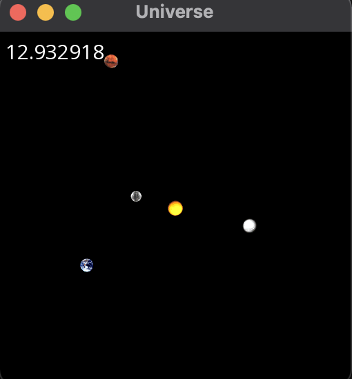
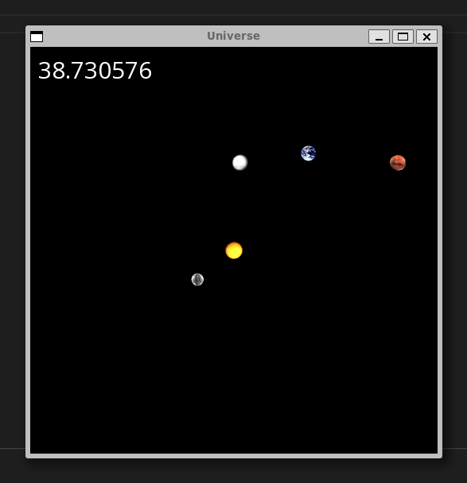

# Planet Simulation with SFML

Welcome to the Planet Simulation project! This project provides a visually engaging simulation of the solar system using the SFML (Simple and Fast Multimedia Library) to render the planets' movements and interactions.

The Planet Simulation project offers an interactive and educational experience that visualizes the motions of planets in our solar system. By utilizing the SFML library, this simulation displays the orbits, rotations, and relative positions of planets, providing a captivating representation of celestial mechanics.

### Preview

#### Prerequisites
Before you begin, ensure you have the following:

- C++ compiler (supporting C++11 or later).
- SFML library installed.
- make command installed

#### Installation

1. Clone this project to Local machine:
2. Navigate to the project directory:

    > cd PlanetSimulator
    
3. Compile using command:

    > make

4. Run the program:
   
    > ./Nbody <Duration> <each tick duration> < ./Asset/planets.txt

#### Customize the simulation
1. Go to Asset Folder
2. Paste all image file into the folder
3. go to "Planet.txt" edit the number regarding ur choice
4. Save, and compile again
